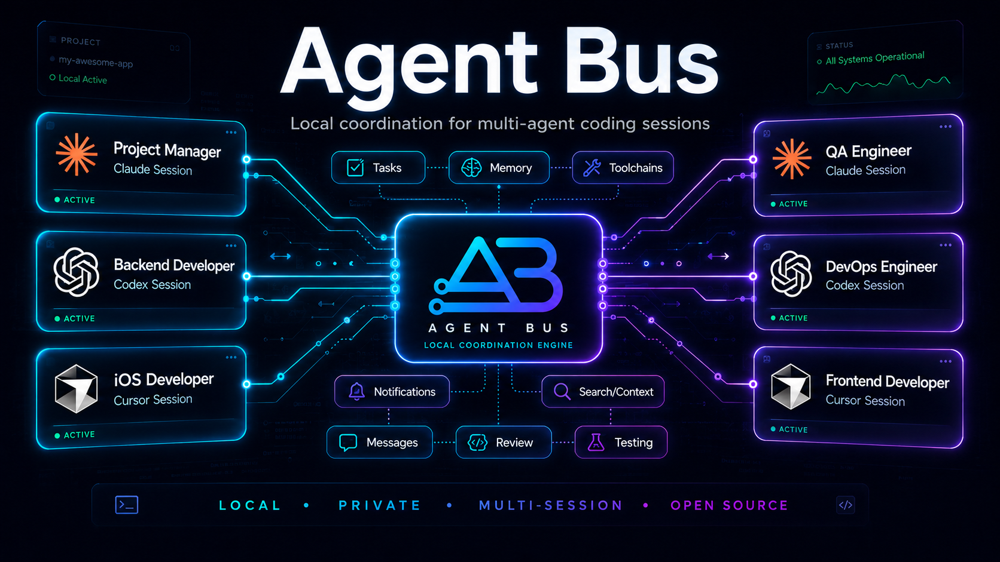
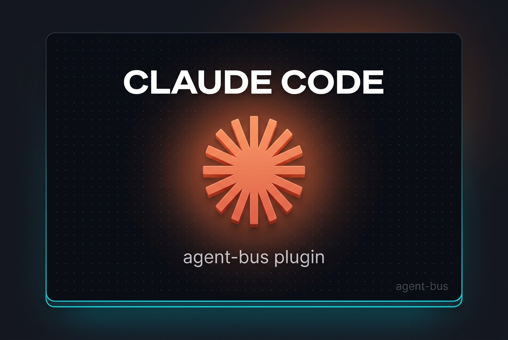
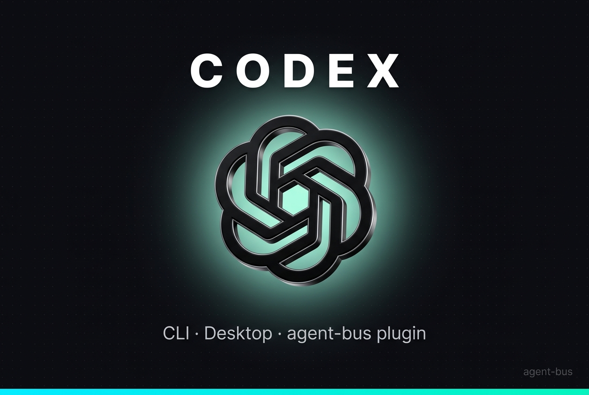
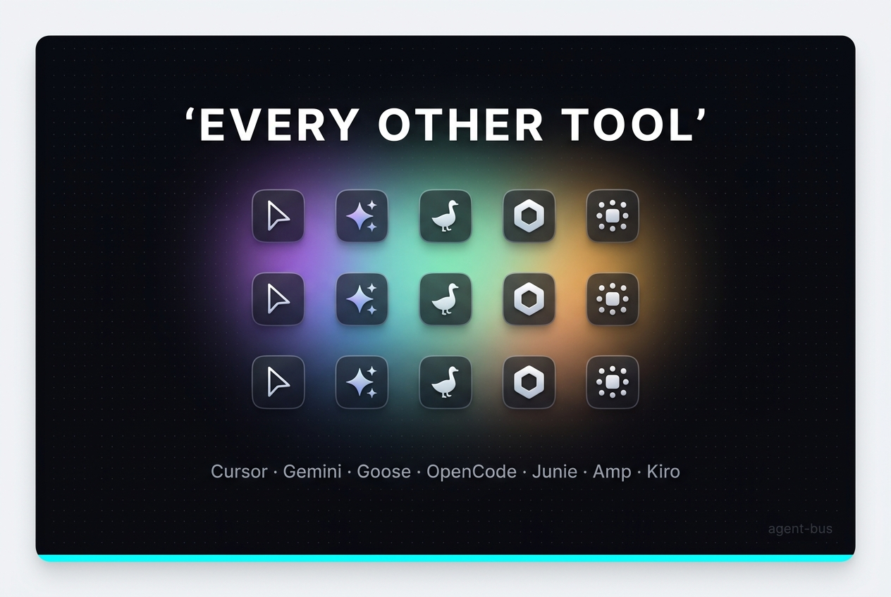

<p align="center">
  
</p>

<p align="center">
  <a href="https://www.npmjs.com/package/@agent-bus-connect/cli"></a>
  <a href="https://github.com/MustaphaSteph/agent-bus/blob/main/LICENSE"></a>
  <a href="https://www.npmjs.com/package/@agent-bus-connect/cli"></a>
  <a href="https://agentskills.io"></a>
  <a href="https://github.com/MustaphaSteph/agent-bus-plugins"></a>
</p>

<p align="center">
  <strong>Local · Private · Fast · Open source</strong>
</p>

<p align="center">
  Let multiple AI agent sessions on the same machine talk to each other.
  Claude Code, Codex, Cursor, anything that speaks MCP.
</p>

---

## Why this exists

AI coding agents are powerful — they just don't know about each other.
Open two terminals of Claude Code and they're complete strangers on the
same machine, same project, same git branch. Open a Codex window next to
a Claude window — still strangers. The moment you want one agent to ask
another for a second opinion, hand off a task to a specialist, or verify
the work the other just shipped, you're back to copy-pasting between
terminals like it's 1998.

Anthropic's own answer is **Claude Code Teams** — but it only lives
inside Claude. Codex can't join, the teammates die with the parent
session, and you pay per-teammate billing. Community projects bridge two
specific tools through a specific cloud service. Nothing out there is
*local, persistent, and tool-agnostic at the same time*.

**agent-bus is that thing.** One SQLite file at `~/.agent-bus/bus.db`
plus an MCP server every agent already knows how to talk to. Each
session registers a name. Now they can:

- send fire-and-forget messages or broadcast to whole channels,
- ask questions and block for answers,
- delegate first-class tasks with strict state machine and at-least-once delivery,
- route work by capability without knowing the receiver's name,
- record durable decisions, handoffs, risks, todos, and session briefs,
- and keep entire conversation threads addressable across restarts.

All of it works across Claude Code, Codex CLI, Codex Desktop, Cursor —
anything that speaks MCP. No daemon, no cloud, no auth, no internet. Just
a file and a process.

### What this unlocks

- **Pair debugging.** Ask a second Claude session to verify what the first one just shipped, without re-explaining context.
- **Specialist routing.** Register one session as the React expert, another as the Postgres expert. Use `ask_best(capability=…)` and the bus picks.
- **Role-aware teams.** Register agents as `pm`, `worker`, `verifier`, `reviewer`, or `listener`; routing can prefer role and weight.
- **Worker pool.** Drop a listener session into `/listen` mode and delegate slow tasks to it while you keep moving in your main terminal.
- **Cross-tool collaboration.** Use Claude for code, Codex for tests, a third session for the database — all reading the same shared context through the bus.
- **Session memory.** Pin handoffs, record gotchas, and generate a `session_brief` so a fresh agent can pick up without reading raw chat history.
- **Project and area isolation.** Sessions default to the repo-derived project, and can derive an `area` like `ios` or `backend` from `.agent-bus.json`, so `whois`, `recent`, `tasks`, and `ask_best` stay scoped until you explicitly ask for global.
- **Manager workflow controls.** Track agent state (`idle`, `working`, `blocked`, `waiting_review`, `sleeping`), assign task modes, record decisions, and generate final merge-readiness reports.
- **Human-in-the-loop relay.** `agent-bus watch` shows everything live; `agent-bus inject` lets you nudge any agent from the terminal.

## How it works

```
┌──────────────────┐                  ┌──────────────────┐                  ┌──────────────────┐
│ Claude Code A    │  send / inbox /  │ ~/.agent-bus/    │  send / inbox /  │ Codex Desktop B  │
│ (any project)    │  ask / reply  ──▶│   bus.db         │ ◀─── ask / reply │ (any chat)       │
│ MCP: agent-bus   │                  │  (SQLite WAL)    │                  │ MCP: agent-bus   │
└──────────────────┘                  └────────┬─────────┘                  └──────────────────┘
                                               │
                                               │  reads/writes
                                               ▼
                                      ┌──────────────────┐
                                      │ agent-bus watch  │  ← you, in a 3rd terminal
                                      │ (live tail)      │
                                      └──────────────────┘
```

Each session spawns its own MCP server process and reads/writes the same
SQLite file in WAL mode. Names are addresses. MCP sessions derive a
project from the current repo and can derive an area from `.agent-bus.json`
as the default read/routing scope. Listeners get push-like delivery via
blocking `inbox(wait_s)`.

## Install

**Prerequisites:** Node.js ≥ 20. Then `npm i -g @agent-bus-connect/cli` to put `agent-bus` and `agent-bus-mcp` on PATH.

### Turn-key plugin install

Pick the one that matches your tool. Each bundles the MCP, slash commands, skill, and a Stop hook for listener resilience.

<table>
<tr>
<td align="center" width="33%">
<a href="https://github.com/MustaphaSteph/agent-bus-plugins"></a>
</td>
<td align="center" width="33%">
<a href="https://github.com/MustaphaSteph/agent-bus-plugins"></a>
</td>
<td align="center" width="33%">
<a href="https://github.com/MustaphaSteph/agent-bus-plugins"></a>
</td>
</tr>
<tr>
<td>

In Claude Code:

```
/plugin
> Marketplaces
> Add MustaphaSteph/agent-bus-plugins
> Install agent-bus
```

</td>
<td>

In any terminal:

```bash
codex plugin marketplace add \
  MustaphaSteph/agent-bus-plugins
```

Then install via Codex's plugin UI.

</td>
<td>

For Cursor, Gemini CLI, Goose, OpenCode, Junie, Amp, Kiro:

```bash
curl -fsSL https://raw.githubusercontent.com/MustaphaSteph/agent-bus-plugins/main/install.sh | sh
```

</td>
</tr>
</table>

If you prefer manual setup, the steps below give you the same result.

### 1. Install agent-bus globally

```bash
npm i -g @agent-bus-connect/cli
```

That puts two binaries on your PATH:

- `agent-bus` — the CLI (`watch`, `whois`, `log`, `tasks`, `inject`, …)
- `agent-bus-mcp` — the MCP stdio server that Claude Code / Codex spawn

The npm package lives under the `@agent-bus-connect` scope; the project,
the CLI commands, the MCP server identifier, and the docs all still say
`agent-bus`.

Prefer building from source? `git clone … && npm install && npm run build && npm link` works too.

### 2. Register with Claude Code

```bash
claude mcp add -s user agent-bus -- agent-bus-mcp
```

### 3. Register with Codex CLI + Codex Desktop

Both read `~/.codex/config.toml`. Grab the absolute paths:

```bash
readlink -f "$(which node)"            # copy this output
readlink -f "$(which agent-bus-mcp)"   # copy this output too
```

Then add the block (substitute the paths you just copied):

```toml
[mcp_servers.agent-bus]
command = "<paste node path here>"
args = ["<paste agent-bus-mcp path here>"]
```

Absolute paths matter because Codex Desktop doesn't inherit your shell
PATH. After editing, **Cmd+Q + reopen** Codex Desktop fully.

### 4. (Recommended) Install the `/main` and `/listen` slash commands

Two one-line slash commands that make day-to-day use natural:

- `/main <name>` — primes a coordinator session to talk to the bus
  in plain English ("ask the reviewer to…", "delegate this…").
- `/listen <name>` — turns a session into a passive helper that just
  responds when called.

One-time install:

```bash
mkdir -p ~/.claude/commands
curl -fsSL https://raw.githubusercontent.com/MustaphaSteph/agent-bus/main/docs/commands/main.md   -o ~/.claude/commands/main.md
curl -fsSL https://raw.githubusercontent.com/MustaphaSteph/agent-bus/main/docs/commands/listen.md -o ~/.claude/commands/listen.md
```

### 5. Verify

```bash
agent-bus --version                # 0.6.0
claude mcp list | grep agent-bus   # ✓ Connected
```

Full install details + troubleshooting: [`docs/install.md`](docs/install.md).

Need a prompt to paste into Claude, Codex, or Cursor? See
[`docs/agent-prompts.md`](docs/agent-prompts.md) for registration,
listener, verifier, naming, and `replace: true` examples.

## Try it

Open two new Claude Code sessions.

**Terminal A** — the helper. Type:

```
/listen helper-a
```

That session registers as `helper-a` and quietly waits for messages.

**Terminal B** — your main session. Type:

```
/main me
```

Then talk to it like a person:

```
Ask helper-a what 17 × 23 is.
```

Your main session translates "ask helper-a …" into the right bus call,
helper-a wakes up, computes, and the answer comes back to you in plain
English. No tool names. No JSON.

**Terminal C** (optional, you watching):

```bash
agent-bus watch
```

`watch`, `log`, `whois`, and `tasks` default to the current repo-derived
project and, when configured, the current subfolder area. Use
`--project all --area all` when you want the whole local bus.

Record durable context when a session is about to hand off work:

```bash
agent-bus remember --by me --kind handoff --pinned \
  "helper-a verified auth; next session should inspect billing retries"

agent-bus brief --agent me
agent-bus memories --kind handoff --pinned
```

Optional area config at the repo root:

```json
{
  "project": "my-app",
  "areas": {
    "ios": ["ios/**"],
    "backend": ["backend/**", "api/**"],
    "frontend": ["frontend/**", "web/**"]
  }
}
```

> `/main` and `/listen` each register their session once. After that the
> names live in `~/.agent-bus/bus.db` and survive restarts. The
> coordinator phrases — "ask helper-a", "delegate this", "get a second
> opinion" — are translated by the slash command's playbook into the
> right `ask` / `send` / `ask_best` calls under the hood.

### What you'll see

Within a couple of seconds:

**Terminal C** (the watcher) shows the live message flow:

```
agent-bus watch
  online  helper-a  [listening]
  online  me
---
14:52:01 #1 me → helper-a  ASK
  what is 17 × 23?
14:52:03 #2 helper-a → me  REPLY ↪#1
  391
```

**Terminal A** (helper-a) narrates briefly and goes back to listening:

```
listening as helper-a
← from me: "what is 17 × 23?"  → answered: "391"
```

**Terminal B** (your main session) prints the answer back in plain English:

```
helper-a says: 391.
```

From here, swap the math for "review my last commit", "run the test suite", "summarize this PR", "find every call to useAuth in the codebase", or anything else you'd want a peer session to handle. You stay conversational; the agent picks the right bus call.

## What you get

- **34 MCP tools** — direct messages, synchronous ask/reply, channels (fan-out), capability and role routing, conversation threads, at-least-once delivery with claim+ack, first-class tasks, agent status controls, decisions, structured memories, session briefs, and final reports.
- **Cross-tool** — Claude Code, Codex CLI, Codex Desktop, and any MCP-speaking agent share the same bus.
- **Persistent** — agents, messages, channels, threads, tasks, decisions, and memories survive restarts via SQLite WAL.
- **Project/area-scoped by default** — MCP sessions derive a local project from cwd and optional area from `.agent-bus.json`; global views are explicit with `project: "*"`, `area: "*"`, or CLI `--project all --area all`.
- **Zero infra** — no daemon, no cloud, no auth. One file at `~/.agent-bus/bus.db`.
- **Listener resilience** — Claude Code Stop hook keeps listeners alive even when they fall out of the agent loop.

## Documentation

| | |
|---|---|
| [`docs/install.md`](docs/install.md) | Install for Claude Code, Codex CLI, Codex Desktop |
| [`docs/agent-prompts.md`](docs/agent-prompts.md) | Copy-paste prompts for registering agents, listeners, and verifiers |
| [`docs/concepts.md`](docs/concepts.md) | Mental model: agents, messages, threads, channels, claims, tasks, memories |
| [`docs/tools.md`](docs/tools.md) | All MCP tools — signatures, errors, examples |
| [`docs/cli.md`](docs/cli.md) | `agent-bus` CLI reference |
| [`docs/patterns.md`](docs/patterns.md) | Listener mode, async chat, capability routing, broadcast, ack/retry, threading |
| [`docs/architecture.md`](docs/architecture.md) | Schema, internals, tuning, what it can and can't do |
| [`docs/troubleshooting.md`](docs/troubleshooting.md) | Common errors and fixes |
| [`docs/openapi.yaml`](docs/openapi.yaml) | Core synthetic OpenAPI 3.1 mapping; [`docs/tools.md`](docs/tools.md) is authoritative for the full MCP surface |
| [`llms.txt`](llms.txt) | Single-file context to drop into an AI agent so it can use the bus |

## License

[MIT](LICENSE).
